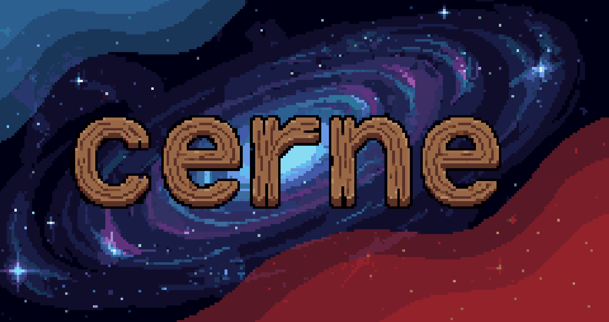

# Cerne


[](https://sonarcloud.io/summary/new_code?id=cernelang_cerne)
[](https://sonarcloud.io/summary/new_code?id=cernelang_cerne)
[](https://sonarcloud.io/summary/new_code?id=cernelang_cerne)
[](https://wakatime.com/badge/user/7a41f42c-75c2-40b0-be7a-459f70a9a37f/project/44b1414e-794f-4376-ad55-c66282484dfc)

Cerne is a systems programming language designed to combine low-level control like C with modern language ergonomics inspired by Python and JavaScript, while avoiding the legacy constraints found in C and C++.

## Quick Overview
While cerne is still on it's development phase, the ideas and features behind it are already majorly defined. 

Here's an example code snippet to simply print Hello World.
```ce
// hello_world.ce
import std.io

fun main() -> i32 {
    std::print("Hello World!")
    return 0
}
```
In case you're curious about more features or tools, please visit [**cerne's website**](https://cerne.space/) for further information.

## Why Cerne?
Cerne was created to explore a more ergonomic approach to systems programming.

It aims to provide:

- Low level control similar to C
- Modern syntax and ergonomics inspired by higher level languages
- A built-in typed assembly interface for low-level and OS development
- A compiler architecture designed for experimentation, tooling, and long-term extensibility

And more...!

## Architecture
Cerne follows a traditional compiler design with fully owned modules (meaning no 3rd party libraries):

- [**Lexer**](./src/front/lexer.cc)     ー Tokenization
- [**Parser**](./src/front/parser/)     ー Generates an AST (pratt + recursive descent)
- [**SEMA**](./src/front/sema/)         ー symbol table and type analysis
- IR            ー 3AC SSA intermediate response generation
- Codegen       ー native machine code
- Linker

More details: https://docs.cerne.space/

## Build
> [!NOTE]
> Prebuilt binaries are available in this repo's releases and on the cerne website's download page. 

You can build cerne from source using CMake. This means that you can build cerne cross-platform (Linux, MacOS, Windows).

### Requirements
- C++20 Compiler (G++, Clang, MSVC, ...)
- CMake ー **Version 3.15 or higher**

### Build Example
```bash
# clone cerne
git clone https://github.com/cernelang/cerne.git
cd cerne

# now create a build directory 
mkdir build && cd build

# build the project
cmake .. && cmake --build .

# now run cerne to check if everything's ok
./cerne version
```

## License
The Cerne Project uses multiple licenses:
- **Compiler**: Licensed under the [LGPL-3.0 license](LICENSE)
- **Standard Library**: Licensed under the [Apache 2.0 license](stdlib/LICENSE)
- **Specification and Documentation**: Licensed under the [CC BY-SA 4.0 License](docs/LICENSE)

Copyright © 2026 Cerne Project

## Contributions
Contributions are welcome! So if you're planning to contribute, please read the [CONTRIBUTING](CONTRIBUTING.md) file in the root directory for more information before submitting a push request.

## Misc
This section is dedicated to non-categorized information about Cerne or anything related to it.

### Additional Information 
**In case you're curious about some additional facts about cerne:**
- Cerne's name is actually the word "cerne" in [Portuguese*](#message-from-the-creator), meaning the core of a tree, which in this case kind of symbolizes a system's core/kernel, which is the main target for cerne (a systems programming language).

#### Message From the Creator
Hi, I'm Kashi, a <ins>CS student currently studying in Germany</ins>. 

I decided to create Cerne because I've been wanting to create a programming language for a really long time, and after diving deep into systems programming, I realized that we still rely on very old programming languages and methods for certain tasks. 

**My goal with this project is NOT to replace the standard**, but rather to introduce a modern alternative for systems programming (and even for general purpose as well) while respecting the decades of work done by genius developers in the compiler industry. :)

[](https://sonarcloud.io/summary/new_code?id=cernelang_cerne)